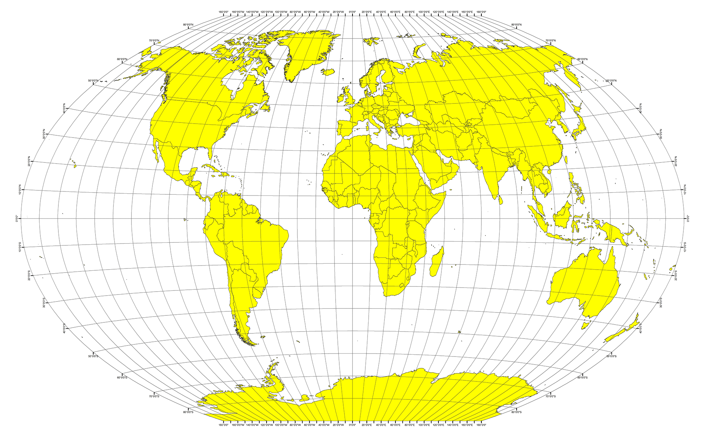

# Python API Homework - What's the Weather Like?

## Primary Coding Language and skills: Python in Jupyter Notebook, API calls, Matplotlib

Whether financial, political, or social -- data's true power lies in its ability to answer questions definitively. So let's take what you've learned about Python requests, APIs, and JSON traversals to answer a fundamental question: "What's the weather like as we approach the equator?"

Now, we know what you may be thinking: _"Duh. It gets hotter..."_

But, if pressed, how would you **prove** it?

### Part I - WeatherPy
####Challenge:
Create a Python script to visualize the weather of 500+ cities across the world of varying distance from the equator. Utilize [simple Python library](https://pypi.python.org/pypi/citipy) and the [OpenWeatherMap API](https://openweathermap.org/api).

Your first requirement is to create a series of scatter plots to showcase the following relationships:

* Temperature (F) vs. Latitude

* Humidity (%) vs. Latitude

* Cloudiness (%) vs. Latitude

* Wind Speed (mph) vs. Latitude

After each plot add a sentence or too explaining what the code is and analyzing.

Your second requirement is to run linear regression on each relationship, only this time separating them into Northern Hemisphere (greater than or equal to 0 degrees latitude) and Southern Hemisphere (less than 0 degrees latitude):

* Northern Hemisphere - Temperature (F) vs. Latitude

* Southern Hemisphere - Temperature (F) vs. Latitude

* Northern Hemisphere - Humidity (%) vs. Latitude

* Southern Hemisphere - Humidity (%) vs. Latitude

* Northern Hemisphere - Cloudiness (%) vs. Latitude

* Southern Hemisphere - Cloudiness (%) vs. Latitude

* Northern Hemisphere - Wind Speed (mph) vs. Latitude

* Southern Hemisphere - Wind Speed (mph) vs. Latitude

After each pair of plots explain what the linear regression is modeling such as any relationships you notice and any other analysis you may have.

Your final notebook must:

* Randomly select **at least** 500 unique (non-repeat) cities based on latitude and longitude.
* Perform a weather check on each of the cities using a series of successive API calls.
* Include a print log of each city as it's being processed with the city number and city name.
* Save a CSV of all retrieved data and a PNG image for each scatter plot.

#### Part II - VacationPy

Now let's use your skills in working with weather data to plan future vacations. Use jupyter-gmaps and the Google Places API for this part of the assignment.

* Create a heat map that displays the humidity for every city from the part I of the homework.

  

* Narrow down the DataFrame to find your ideal weather condition. For example:
``ideal_df = weather_df.loc[(weather_df["Max Temp"] > 65) & (weather_df['Max Temp'] < 77) & (weather_df["Cloudiness"] == 0) & (weather_df['Humidity'] < 50) &(weather_df['Wind Speed'] < 15), :]``

* Using Google Places API to find the first hotel for each city located within 5000 meters of your coordinates.
``  "radius": 5000,
    "types": "lodging",
    "keyword": "Hotel",
    "key": gkey``
    
* Plot the hotels on top of the humidity heatmap with each pin containing the **Hotel Name**, **City**, and **Country**.

  

